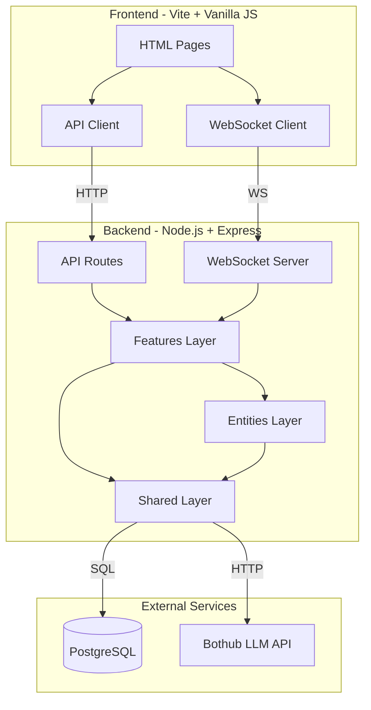
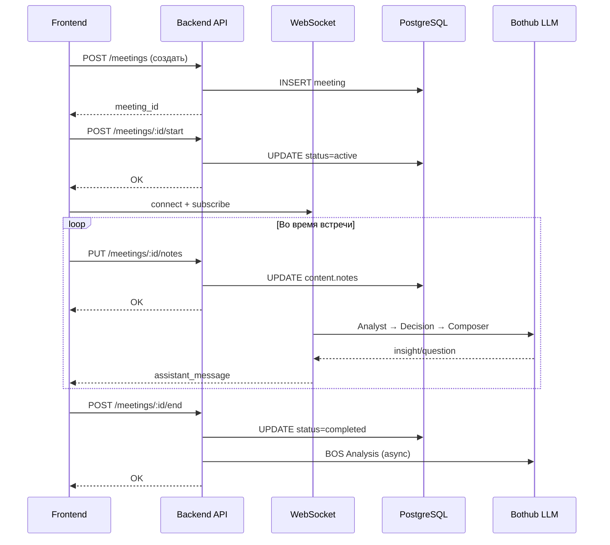
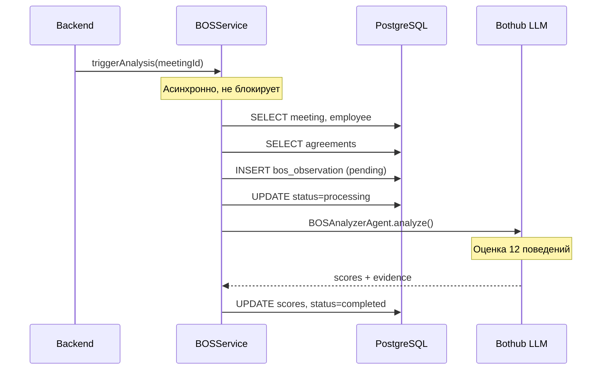
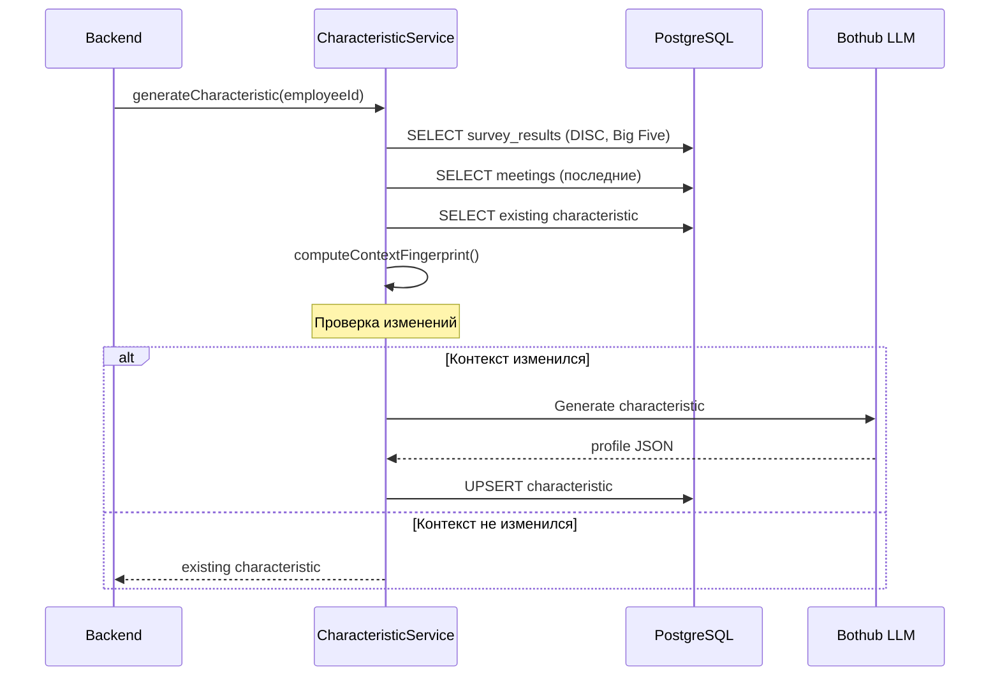
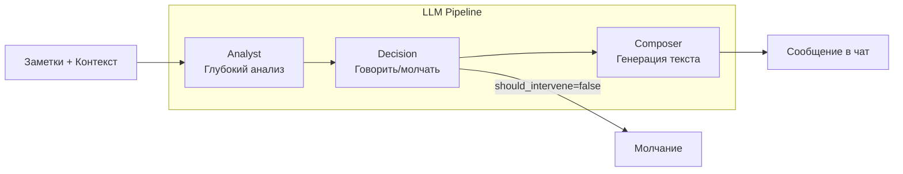

# Архитектура системы O2O

## Обзор

O2O построена по принципам **Feature-Sliced Design** — архитектурной методологии для frontend и backend приложений, обеспечивающей модульность, масштабируемость и понятность кода.

---

## Высокоуровневая архитектура



---

## Слои Backend

### 1. App Layer (`backend/src/app/`)

Точка входа приложения. Конфигурация Express, подключение роутов, запуск сервера.

```
app/
├── server.ts          # Запуск HTTP + WebSocket сервера
└── routes.ts          # Регистрация всех API роутов
```

### 2. Entities Layer (`backend/src/entities/`)

Доменные сущности — модели данных с методами доступа к БД.

```
entities/
├── employee/          # Сотрудники
│   └── model/employee.ts
├── meeting/           # Встречи
│   └── model/meeting.ts
├── agreement/         # Договорённости
│   └── model/agreement.ts
├── survey/            # Опросы
│   └── model/survey.ts
├── characteristic/    # AI-характеристики
│   └── model/characteristic.ts
└── bos-observation/   # BOS-наблюдения
    └── model/bos-observation.ts
```

**Принцип:** Entity знает только про себя и shared-слой. Не знает про features.

### 3. Features Layer (`backend/src/features/`)

Функциональные модули — бизнес-логика, API роуты, сервисы.

```
features/
├── employees/         # CRUD сотрудников
│   ├── api/routes.ts
│   └── lib/validation.ts
│
├── meetings/          # Встречи + BOS
│   ├── api/routes.ts
│   └── lib/bos-service.ts
│
├── surveys/           # Система опросов
│   ├── api/routes.ts
│   └── lib/
│       ├── survey-service.ts
│       └── interpreters/    # DISC, Big Five LLM
│
├── characteristics/   # AI-характеристики
│   ├── api/routes.ts
│   └── index.ts
│
├── agreements/        # Договорённости
│   └── api/routes.ts
│
└── assistant/         # AI-ассистент
    ├── agents/        # Analyst, Decision, Composer, BOS
    ├── prompts/       # LLM промпты
    ├── orchestrator.ts
    ├── ws.ts          # WebSocket handler
    └── context.ts     # Сбор контекста для LLM
```

### 4. Shared Layer (`backend/src/shared/`)

Переиспользуемые модули: БД, LLM, утилиты.

```
shared/
├── database/
│   ├── connection.ts      # PostgreSQL pool
│   └── migrations/        # SQL миграции
│
├── llm/
│   └── textService.ts     # Bothub LLM клиент
│
├── api/
│   └── middleware.ts      # Валидация, UUID
│
├── config/
│   └── llm.ts             # Конфигурация моделей
│
├── lib/
│   ├── characteristic-generation.ts  # Генерация профилей
│   └── characteristic-auto-update.ts
│
└── types/
    └── common.ts          # Общие типы
```

---

## Потоки данных

### Поток 1: Проведение встречи



### Поток 2: BOS-анализ



### Поток 3: Генерация характеристики



---

## Мульти-агентная архитектура AI-ассистента



| Агент | Роль | Модель | Temperature |
|-------|------|--------|-------------|
| **Analyst** | Поиск инсайтов, паттернов, рисков | gpt-4o | 0.4 |
| **Decision** | Решение: вмешиваться или молчать | gpt-4o-mini | 0.2 |
| **Composer** | Генерация читаемого сообщения | gpt-4o | 0.6 |
| **BOSAnalyzer** | Оценка 12 поведений | claude-sonnet | 0.2 |

---

## Интеграции

### PostgreSQL

- **Подключение:** `pg` pool через `shared/database/connection.ts`
- **Хранение:** JSONB для гибких структур (meetings.content, bos_observations.scores)
- **Миграции:** SQL файлы в `shared/database/migrations/`

### Bothub LLM

- **Клиент:** `shared/llm/textService.ts`
- **API:** OpenAI-совместимый Chat Completions
- **Модели:** gpt-4o, gpt-4o-mini, claude-sonnet-4-20250514

### WebSocket

- **Сервер:** `features/assistant/ws.ts`
- **Библиотека:** `ws`
- **События:** typing, notes_updated, assistant_message

---

## Принципы разработки

1. **Feature-Sliced Design** — модули изолированы по фичам
2. **Dependency Rule** — зависимости только вниз (features → entities → shared)
3. **Single Responsibility** — каждый модуль делает одно дело
4. **JSONB для гибкости** — структурированные данные в PostgreSQL
5. **Async LLM** — тяжёлые LLM-задачи не блокируют API

---

## Связанная документация

- [Схема базы данных](DATABASE.md)
- [LLM Pipeline спецификация](llm-pipeline-spec.md)
- [API документация](api/)


