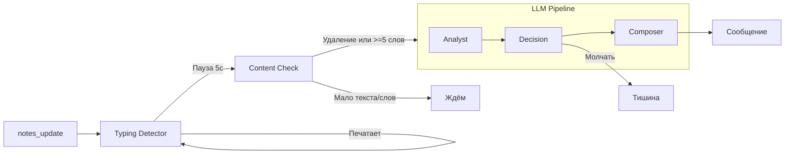

# AI-ассистент для встреч

## Что это такое

AI-ассистент — это интеллектуальный помощник, который работает в реальном времени во время one-to-one встречи. Он анализирует заметки руководителя и при необходимости предлагает вопросы, инсайты или предупреждения.

---

## Зачем это нужно

| Проблема | Решение |
|----------|---------|
| Руководитель не знает что спросить | Ассистент предлагает мощные вопросы |
| Упускаются важные сигналы | Ассистент замечает риски (выгорание, демотивация) |
| Банальные разговоры | Ассистент углубляет диалог |
| Информационная перегрузка | Ассистент молчит когда не нужен |

---

## Ключевой принцип: умное молчание

В отличие от чат-ботов, которые отвечают на каждое сообщение, наш ассистент **молчит в 70-80% случаев**. Он вмешивается только когда:

- Заметил реальный риск (выгорание, конфликт)
- Есть неочевидный инсайт
- Может предложить мощный вопрос
- Виден важный тренд

---

## Архитектура: Typing Detection + LLM Pipeline

Ассистент работает в два этапа:

1. **Typing Detection** — определение когда пользователь закончил печатать
2. **Content Check** — проверка достаточно ли контента для анализа
3. **LLM Pipeline** — мульти-агентный анализ и генерация рекомендации



---

## Typing Detection (Определение паузы)

Ассистент ждёт пока пользователь **прекратит печатать** прежде чем анализировать.

### Как это работает

1. При каждом `notes_update` — запускается таймер на **5 секунд**
2. Если приходит новый `notes_update` — таймер **сбрасывается**
3. Когда таймер истекает — пауза обнаружена, переходим к Content Check

### Логи в UI

```
⌨️ Печатает... ожидаем паузу 5с
⌨️ Печатает... (таймер сброшен)
✅ Пауза 5с
```

---

## Content Check (Проверка контента)

После паузы проверяем: достаточно ли контента для анализа?

### Логика проверки

```
[Пауза 5с обнаружена]
         ↓
[Текста >= 10 слов?]
    ↓ НЕТ → ждём
    ↓ ДА
[Удаление из baseline >10% ИЛИ >4 слов?]
    ↓ ДА → сброс baseline → АНАЛИЗ
    ↓ НЕТ
[Новых слов >= 5?]
    ↓ ДА → АНАЛИЗ
    ↓ НЕТ → ждём
```

### Baseline (точка отсчёта)

Baseline — это **Set уникальных слов** на момент последней рекомендации.

**Обновляется когда:**
- Обнаружено значительное удаление → сбрасывается на текущий текст
- После успешной рекомендации ассистента

**Зачем Set:** Позволяет дёшево определить какие слова из baseline полностью исчезли из текста.

### Пример удаления

```
Baseline: {"вася", "сказал", "устал", "команда"} (50 слов)

Пользователь удалил: "команда устал сказал"
Но слово "сказал" осталось в другом месте текста

Проверяем:
- "вася" в тексте? ✅
- "сказал" в тексте? ✅ (осталось в другом месте)
- "устал" в тексте? ❌ пропало
- "команда" в тексте? ❌ пропала

Удалено: 2 слова (4%) — меньше порога, считаем новые слова
```

### Логи в UI

```
📝 Новых слов: 6 >= 5 → анализ
🔄 Удаление: 5 слов (33%) — сброс baseline → анализ
⏳ Мало новых слов: 2 из 5
⏳ Мало текста: 3 слов < 10 минимум
```

---

## Мульти-агентная архитектура (LLM Pipeline)

После прохождения Content Check запускается LLM Pipeline из трёх агентов:

### 1. Analyst (Аналитик)

**Задача:** Глубокий анализ контекста

**Что делает:**
- Ищет паттерны в заметках
- Сравнивает с историей прошлых встреч
- Находит противоречия
- Определяет настроение сотрудника

**Выход:**
```json
{
  "insights": [
    {
      "type": "risk",
      "description": "Сотрудник 3-ю встречу подряд говорит о перегрузке",
      "confidence": 0.85,
      "relevance": "high"
    }
  ],
  "employee_state": {
    "sentiment": "negative",
    "engagement_level": "medium"
  }
}
```

### 2. Decision (Решатель)

**Задача:** Решить — говорить или молчать

**Когда молчать:**
- Инсайт банальный или очевидный
- Уже говорил похожее недавно
- Руководитель "в потоке"
- Прошло мало времени от начала встречи

**Когда говорить:**
- Реальный риск (выгорание, увольнение)
- Ценный неочевидный инсайт
- Можно предложить мощный вопрос

**Выход:**
```json
{
  "should_intervene": true,
  "intervention_type": "warning",
  "reason": "Паттерн перегрузки требует внимания",
  "priority": "high"
}
```

### 3. Composer (Композитор)

**Задача:** Сгенерировать читаемое сообщение

**Типы сообщений:**

| Тип | Формат | Пример |
|-----|--------|--------|
| `proactive_question` | Вопрос | "Что если делегировать часть рутины?" |
| `warning` | Предупреждение | "⚠️ Третья встреча с упоминанием перегрузки" |
| `insight` | Наблюдение | "💡 Интерес к лидерству растёт" |
| `action_card` | Действие | Карточка запуска опроса |

**Ограничение:** Максимум 280 символов (как твит)

---

## Модели LLM

| Агент | Модель | Temperature | Почему |
|-------|--------|-------------|--------|
| Analyst | gpt-4o | 0.4 | Нужна аналитичность |
| Decision | gpt-4o-mini | 0.2 | Нужна консистентность |
| Composer | gpt-4o | 0.6 | Нужна креативность |

---

## WebSocket интеграция

### Подключение

```javascript
const ws = new WebSocket('ws://localhost:3001/ws/assistant');

ws.onopen = () => {
  ws.send(JSON.stringify({
    type: 'join',
    meetingId: 'meeting-uuid',
    employeeId: 'employee-uuid'
  }));
};
```

### События

**От клиента к серверу:**

| Событие | Описание |
|---------|----------|
| `join` | Подключение к встрече |
| `notes_update` | Обновление заметок (при каждом изменении) |
| `user_message` | Прямое сообщение ассистенту |
| `ping` | Проверка соединения |

**От сервера к клиенту:**

| Событие | Описание |
|---------|----------|
| `joined` | Подтверждение подключения |
| `assistant_message` | Сообщение/рекомендация ассистента |
| `action_card` | Карточка действия (опрос, договорённость) |
| `status` | Статус ассистента (`thinking`, `idle`) |
| `pipeline_log` | Лог для отладки (typing_detection, content_check) |
| `error` | Ошибка |
| `pong` | Ответ на ping |

### Throttling и Debounce

| Механизм | Значение | Описание |
|----------|----------|----------|
| Фронтенд debounce | 500ms | Отправка notes_update после остановки ввода |
| Серверный debounce | 5000ms | Ожидание паузы перед анализом |
| Throttling ответов | 800ms | Минимум между ответами ассистента |

---

## Контекст для анализа

Ассистент получает:

1. **Текущие заметки** — что пишет руководитель сейчас
2. **Профиль сотрудника** — DISC, Big Five, характеристика
3. **История встреч** — 3-5 последних встреч
4. **Открытые договорённости** — невыполненные задачи
5. **Статистика** — встречи, договорённости

---

## Пример работы

### Ситуация

Руководитель пишет:
> "Иван снова говорит что не успевает. Много совещаний. Устал."

### Analyst

```json
{
  "insights": [{
    "type": "pattern",
    "description": "Третье упоминание перегрузки за 3 встречи",
    "confidence": 0.9,
    "evidence": ["не успевает", "много совещаний", "устал"]
  }],
  "employee_state": {
    "sentiment": "negative",
    "engagement_level": "low"
  }
}
```

### Decision

```json
{
  "should_intervene": true,
  "intervention_type": "warning",
  "reason": "Паттерн перегрузки — риск выгорания",
  "priority": "high"
}
```

### Composer

```
⚠️ Третья встреча подряд с жалобами на перегрузку. 
Стоит обсудить конкретные шаги: что можно делегировать или отменить?
```

---

## Конфигурация

Файл: `backend/src/features/assistant/config.ts`

```typescript
export const ASSISTANT_CONFIG = {
  // ═══════════════════════════════════════════
  // TYPING DETECTION
  // ═══════════════════════════════════════════
  
  /** Пауза без ввода перед анализом (мс) */
  debounceMs: 5000,              // 5 секунд
  
  // ═══════════════════════════════════════════
  // CONTENT CHECK
  // ═══════════════════════════════════════════
  
  /** Минимум новых слов для запуска анализа */
  minWordsDelta: 5,
  
  /** Минимум текста для анализа (слов) */
  minWordsForAnalysis: 10,
  
  /** Порог удаления в % от baseline */
  deletionThresholdPercent: 10,
  
  /** Порог удаления в словах */
  deletionThresholdWords: 4,
  
  // ═══════════════════════════════════════════
  // THROTTLING
  // ═══════════════════════════════════════════
  
  /** Минимальный интервал между ответами (мс) */
  minIntervalMs: 800,
  
  // ═══════════════════════════════════════════
  // TIMEOUTS
  // ═══════════════════════════════════════════
  
  timeouts: {
    immediateAnalyst: 10000,   // Быстрый анализ
    deepAnalyst: 15000,        // Глубокий анализ с историей
    profileDeviation: 10000,   // Проверка отклонений
    decision: 10000,           // Decision агент
    composer: 10000,           // Composer агент
    pipelineTotal: 60000       // Общий таймаут pipeline
  }
};
```

### Параметры Content Check

| Параметр | Значение | Описание |
|----------|----------|----------|
| `debounceMs` | 5000 | Пауза в мс перед анализом |
| `minWordsDelta` | 5 | Минимум новых слов |
| `minWordsForAnalysis` | 10 | Минимум текста для анализа |
| `deletionThresholdPercent` | 10 | Порог удаления в % |
| `deletionThresholdWords` | 4 | Порог удаления в словах |

---

## Связанная документация

- [Встречи one-to-one](meetings.md)
- [LLM Pipeline спецификация](../llm-pipeline-spec.md)
- [WebSocket API](../api/websocket-api.md)
- [Архитектура](../ARCHITECTURE.md)


