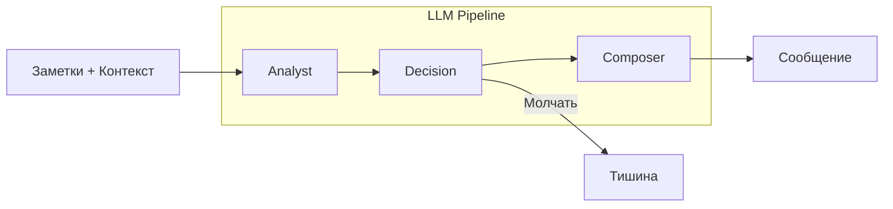

# AI-ассистент для встреч

## Что это такое

AI-ассистент — это интеллектуальный помощник, который работает в реальном времени во время one-to-one встречи. Он анализирует заметки руководителя и при необходимости предлагает вопросы, инсайты или предупреждения.

---

## Зачем это нужно

| Проблема | Решение |
|----------|---------|
| Руководитель не знает что спросить | Ассистент предлагает мощные вопросы |
| Упускаются важные сигналы | Ассистент замечает риски (выгорание, демотивация) |
| Банальные разговоры | Ассистент углубляет диалог |
| Информационная перегрузка | Ассистент молчит когда не нужен |

---

## Ключевой принцип: умное молчание

В отличие от чат-ботов, которые отвечают на каждое сообщение, наш ассистент **молчит в 70-80% случаев**. Он вмешивается только когда:

- Заметил реальный риск (выгорание, конфликт)
- Есть неочевидный инсайт
- Может предложить мощный вопрос
- Виден важный тренд

---

## Мульти-агентная архитектура

Ассистент состоит из трёх специализированных LLM-агентов:



### 1. Analyst (Аналитик)

**Задача:** Глубокий анализ контекста

**Что делает:**
- Ищет паттерны в заметках
- Сравнивает с историей прошлых встреч
- Находит противоречия
- Определяет настроение сотрудника

**Выход:**
```json
{
  "insights": [
    {
      "type": "risk",
      "description": "Сотрудник 3-ю встречу подряд говорит о перегрузке",
      "confidence": 0.85,
      "relevance": "high"
    }
  ],
  "employee_state": {
    "sentiment": "negative",
    "engagement_level": "medium"
  }
}
```

### 2. Decision (Решатель)

**Задача:** Решить — говорить или молчать

**Когда молчать:**
- Инсайт банальный или очевидный
- Уже говорил похожее недавно
- Руководитель "в потоке"
- Прошло мало времени от начала встречи

**Когда говорить:**
- Реальный риск (выгорание, увольнение)
- Ценный неочевидный инсайт
- Можно предложить мощный вопрос

**Выход:**
```json
{
  "should_intervene": true,
  "intervention_type": "warning",
  "reason": "Паттерн перегрузки требует внимания",
  "priority": "high"
}
```

### 3. Composer (Композитор)

**Задача:** Сгенерировать читаемое сообщение

**Типы сообщений:**

| Тип | Формат | Пример |
|-----|--------|--------|
| `proactive_question` | Вопрос | "Что если делегировать часть рутины?" |
| `warning` | Предупреждение | "⚠️ Третья встреча с упоминанием перегрузки" |
| `insight` | Наблюдение | "💡 Интерес к лидерству растёт" |
| `action_card` | Действие | Карточка запуска опроса |

**Ограничение:** Максимум 280 символов (как твит)

---

## Модели LLM

| Агент | Модель | Temperature | Почему |
|-------|--------|-------------|--------|
| Analyst | gpt-4o | 0.4 | Нужна аналитичность |
| Decision | gpt-4o-mini | 0.2 | Нужна консистентность |
| Composer | gpt-4o | 0.6 | Нужна креативность |

---

## WebSocket интеграция

### Подключение

```javascript
const ws = new WebSocket('ws://localhost:3001/ws');

ws.onopen = () => {
  ws.send(JSON.stringify({
    type: 'subscribe',
    meetingId: 'meeting-uuid',
    employeeId: 'employee-uuid'
  }));
};
```

### События

**От клиента к серверу:**

| Событие | Описание |
|---------|----------|
| `subscribe` | Подписка на встречу |
| `notes_updated` | Обновление заметок |
| `typing` | Пользователь печатает |

**От сервера к клиенту:**

| Событие | Описание |
|---------|----------|
| `assistant_message` | Сообщение ассистента |
| `assistant_typing` | Ассистент "думает" |

### Throttling

- Минимум 2.5 секунды между ответами
- Debounce на ввод текста
- Кэширование анализа

---

## Контекст для анализа

Ассистент получает:

1. **Текущие заметки** — что пишет руководитель сейчас
2. **Профиль сотрудника** — DISC, Big Five, характеристика
3. **История встреч** — 3-5 последних встреч
4. **Открытые договорённости** — невыполненные задачи
5. **Статистика** — встречи, договорённости

---

## Пример работы

### Ситуация

Руководитель пишет:
> "Иван снова говорит что не успевает. Много совещаний. Устал."

### Analyst

```json
{
  "insights": [{
    "type": "pattern",
    "description": "Третье упоминание перегрузки за 3 встречи",
    "confidence": 0.9,
    "evidence": ["не успевает", "много совещаний", "устал"]
  }],
  "employee_state": {
    "sentiment": "negative",
    "engagement_level": "low"
  }
}
```

### Decision

```json
{
  "should_intervene": true,
  "intervention_type": "warning",
  "reason": "Паттерн перегрузки — риск выгорания",
  "priority": "high"
}
```

### Composer

```
⚠️ Третья встреча подряд с жалобами на перегрузку. 
Стоит обсудить конкретные шаги: что можно делегировать или отменить?
```

---

## Конфигурация

Файл: `backend/src/features/assistant/config.ts`

```typescript
export const ASSISTANT_CONFIG = {
  // Политики
  minIntervalMs: 2500,        // Минимум между ответами
  maxMessagesPerSession: 10,  // Лимит сообщений
  
  // LLM
  analystModel: 'gpt-4o',
  decisionModel: 'gpt-4o-mini',
  composerModel: 'gpt-4o',
  
  // Контекст
  previousMeetingsCount: 5,   // Сколько прошлых встреч брать
};
```

---

## Связанная документация

- [Встречи one-to-one](meetings.md)
- [LLM Pipeline спецификация](../llm-pipeline-spec.md)
- [WebSocket API](../api/websocket-api.md)
- [Архитектура](../ARCHITECTURE.md)
