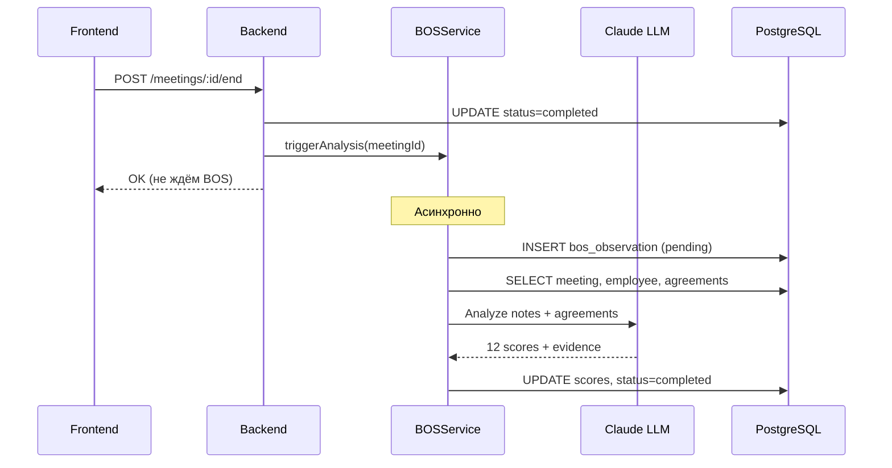

# BOS-анализ поведения

## Что такое BOS

**BOS (Behavioral Observation Scale)** — методика структурированного наблюдения и оценки рабочего поведения сотрудников. В отличие от субъективных впечатлений, BOS основан на конкретных наблюдаемых действиях.

---

## Зачем это нужно

| Проблема | Решение с BOS |
|----------|---------------|
| "Он хороший сотрудник" — слишком общо | Конкретные оценки по 12 поведениям |
| Субъективные впечатления | Доказательства из реальных заметок |
| Нет динамики развития | Тренды по поведениям от встречи к встрече |
| Руководитель забывает детали | AI фиксирует и анализирует автоматически |

---

## 12 ключевых поведений

### Коммуникация

| Поведение | Описание | Примеры |
|-----------|----------|---------|
| **Выражение проблем** | Ясно и своевременно называет проблемы | "У меня сложность с дедлайном", "Не хватает ресурсов" |
| **Выражение интересов** | Рассказывает о своих интересах и устремлениях | "Хочу развиваться в ML", "Интересует роль тимлида" |
| **Инициативная коммуникация** | Сам инициирует обсуждения, не ждёт вопросов | Задаёт вопросы, предлагает темы |

### Взаимодействие

| Поведение | Описание | Примеры |
|-----------|----------|---------|
| **Сотрудничество** | Работает с другими, помогает коллегам | "Помог Ане с задачей", "Мы вместе решили" |
| **Восприимчивость к обратной связи** | Конструктивно принимает критику | "Понял, буду улучшать", не защищается |
| **Эмоциональный интеллект** | Понимает свои и чужие эмоции | "Чувствую усталость", "Вижу, что команда напряжена" |

### Ответственность

| Поведение | Описание | Примеры |
|-----------|----------|---------|
| **Ответственность за задачи** | Берёт на себя ответственность за результат | "Я отвечу за это", признаёт ошибки |
| **Соблюдение договорённостей** | Выполняет обещания из прошлых встреч | "Сделал, как договаривались" |
| **Качество решений** | Принимает взвешенные решения самостоятельно | Объясняет логику выбора |

### Развитие

| Поведение | Описание | Примеры |
|-----------|----------|---------|
| **Согласованность целей** | Понимает связь работы с целями команды | "Это поможет нам достичь KPI" |
| **Готовность к обучению** | Хочет развиваться, учиться новому | "Хочу освоить TypeScript" |
| **Стратегическое мышление** | Думает о долгосрочной перспективе | "В будущем это позволит нам..." |

---

## Шкала оценки

Каждое поведение оценивается по шкале 1-5:

| Оценка | Значение | Интерпретация |
|--------|----------|---------------|
| **1** | Никогда | Поведение не демонстрируется |
| **2** | Редко | Иногда, но непоследовательно |
| **3** | Иногда | Средний уровень |
| **4** | Часто | Регулярно демонстрирует |
| **5** | Всегда | Стабильно высокий уровень |
| **null** | Не наблюдалось | Недостаточно данных для оценки |

**Важно:** `null` — это не "плохо", это "данных недостаточно". Не все поведения проявляются на каждой встрече.

---

## Как работает автоматический анализ

### Триггер анализа

BOS-анализ запускается автоматически при завершении встречи:



### Входные данные для анализа

1. **Заметки руководителя** — основной источник
2. **Договорённости** — показывают ответственность
3. **Имя сотрудника** — для контекста

### Выходные данные

```json
{
  "problem_articulation": {
    "score": 4,
    "evidence": "Чётко назвал проблему с дедлайнами"
  },
  "learning_agility": {
    "score": 5,
    "evidence": "Хочет изучить TypeScript"
  },
  "decision_quality": {
    "score": null,
    "evidence": null
  }
}
```

---

## Применение для развития сотрудников

### Индивидуальное развитие

- Определить сильные стороны (4-5 баллов)
- Найти зоны роста (1-2 балла)
- Отслеживать прогресс по встречам

### Командная аналитика

- Сравнить профили команды
- Найти общие паттерны
- Выявить потребности в обучении

### Коучинговые беседы

Используйте BOS как основу для обратной связи:
- "На прошлой встрече ты отлично выразил проблемы — это важный навык"
- "Давай поработаем над инициативной коммуникацией"

---

## Ограничения

1. **Зависит от качества заметок** — если заметки краткие, анализ будет неполным
2. **Одна встреча — не вся картина** — нужна серия встреч для трендов
3. **Контекст важен** — низкая оценка может быть нормой для конкретной ситуации

---

## Статусы обработки

| Статус | Описание |
|--------|----------|
| `pending` | Анализ в очереди |
| `processing` | LLM обрабатывает |
| `completed` | Готово, есть результаты |
| `failed` | Ошибка (можно перезапустить) |

---

## Интерфейс пользователя

### В профиле встречи

После завершения встречи появляется раскрывающийся блок "BOS-анализ":
- Статус обработки
- 12 оценок с точками (1-5)
- Цитаты-доказательства
- Кнопка "Перезапустить" при ошибке

### В профиле сотрудника

- История BOS-оценок по встречам
- Тренды по каждому поведению (планируется)
- Сильные стороны и зоны роста

---

## Связанная документация

- [Встречи one-to-one](meetings.md)
- [AI-ассистент](assistant.md)
- [BOS API](../api/bos-api.md)
- [Схема базы данных](../DATABASE.md)


