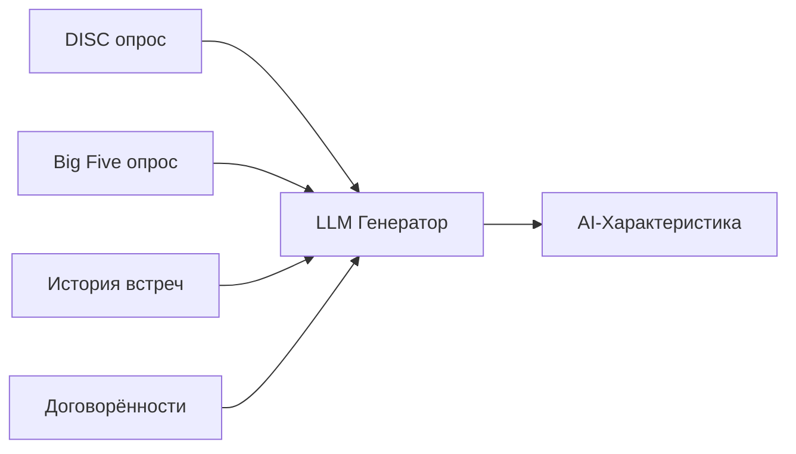
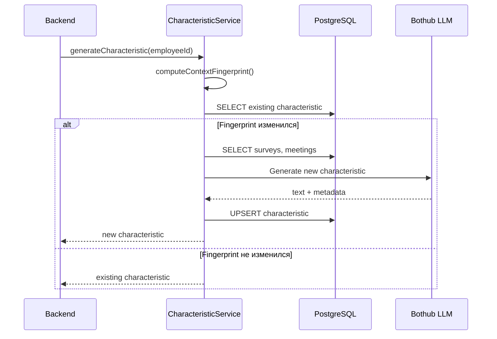

# AI-характеристики сотрудников

## Что это такое

AI-характеристика — это автоматически генерируемый профиль сотрудника, объединяющий данные из разных источников и превращающий их в практические рекомендации для руководителя.

---

## Зачем это нужно

| Проблема | Решение |
|----------|---------|
| Данные разбросаны по разным местам | Единый профиль со всей информацией |
| DISC и Big Five — сухие цифры | LLM превращает баллы в понятный текст |
| Рекомендации общие, не персональные | Рекомендации под конкретного сотрудника |
| Руководитель забывает особенности | Профиль всегда под рукой |
| Информация устаревает | Автообновление при изменении данных |

---

## Источники данных



### 1. DISC-профиль

Используются баллы D/I/S/C и первичный/вторичный типы.

### 2. Big Five профиль

Используются баллы O/C/E/A/N и интерпретации.

### 3. История встреч

- Ключевые темы из заметок
- Частые проблемы
- Тренды настроения

### 4. Договорённости

- Процент выполнения
- Типы задач (сотрудник/руководитель)
- Сложности с дедлайнами

---

## Структура характеристики

### Текстовое содержание

```
Иван — прямой и целеустремлённый сотрудник типа D (Dominance) по DISC. 
Предпочитает чёткие цели и быстрые решения. По Big Five показывает 
высокую открытость новому опыту (O=70) и организованность (C=65).

СИЛЬНЫЕ СТОРОНЫ:
• Берёт ответственность за результат
• Быстро адаптируется к новым задачам
• Хорошо справляется со стрессом (низкий N=40)

ЗОНЫ РАЗВИТИЯ:
• Иногда может быть слишком прямолинеен в коммуникации
• Нуждается в признании достижений

РЕКОМЕНДАЦИИ ПО ВЗАИМОДЕЙСТВИЮ:
• Давать сложные задачи с чёткими целями
• Обеспечивать автономность в принятии решений
• Регулярно признавать достижения
• Не перегружать деталями — фокус на результате
```

### Метаданные

```json
{
  "generation_metadata": {
    "model": "gpt-4o",
    "context_fingerprint": "abc123",
    "generation_time_ms": 3500,
    "sources": {
      "disc_results": 1,
      "bigfive_results": 1,
      "meetings_count": 5,
      "agreements_count": 12
    }
  }
}
```

---

## Как работает генерация

### Автоматический триггер

Характеристика обновляется автоматически при:
- Завершении нового опроса DISC/Big Five
- (Опционально) При накоплении новых встреч

### Проверка изменений

Система использует "fingerprint" контекста:



### Fingerprint

Хэш от:
- ID и дат последних опросов
- Количество и даты последних встреч
- Количество договорённостей

Если fingerprint не изменился — регенерация не нужна.

---

## API

### Получить характеристику

```
GET /api/characteristics/:employeeId
```

### Сгенерировать/обновить

```
POST /api/characteristics/:employeeId/generate
POST /api/characteristics/:employeeId/generate?force=true  # принудительно
```

### Удалить

```
DELETE /api/characteristics/:employeeId
```

---

## Использование в UI

### Профиль сотрудника

Характеристика отображается на странице сотрудника:
- Полный текст профиля
- Дата последнего обновления
- Кнопка "Обновить характеристику"

### Перед встречей

Руководитель может:
- Быстро освежить в памяти особенности сотрудника
- Подготовить персонализированные вопросы
- Учесть стиль коммуникации

---

## Преимущества

1. **Экономия времени** — не нужно перечитывать все опросы и заметки
2. **Практичность** — конкретные рекомендации, а не абстрактные баллы
3. **Актуальность** — автообновление при изменении данных
4. **Интеграция** — данные из всех источников в одном месте
5. **AI-качество** — LLM понимает контекст и генерирует осмысленный текст

---

## Ограничения

1. **Зависит от входных данных** — если нет опросов, характеристика будет неполной
2. **LLM может ошибаться** — рекомендуется проверять критичные выводы
3. **Это инструмент, не замена** — не заменяет личное общение с сотрудником

---

## Связанная документация

- [Система опросов](surveys.md)
- [Встречи one-to-one](meetings.md)
- [API характеристик](../api/characteristics-api.md)
- [Схема базы данных](../DATABASE.md)


