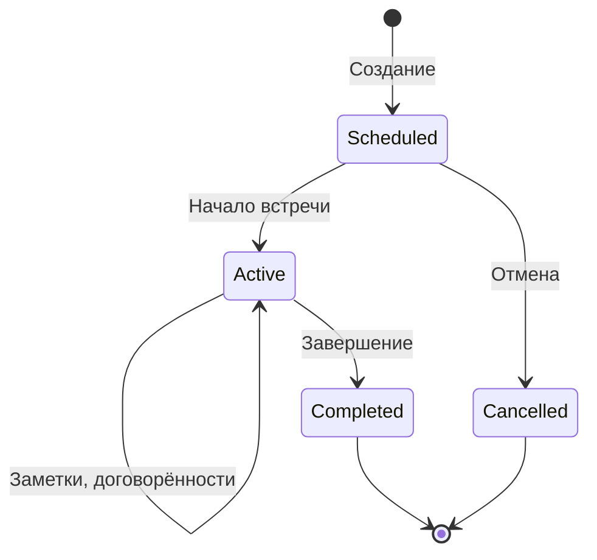

# Встречи One-to-One

## Зачем нужны встречи one-to-one

One-to-one (1:1) — это регулярные индивидуальные встречи руководителя с каждым членом команды. Это ключевой инструмент для:

- **Построения доверия** между руководителем и сотрудником
- **Раннего выявления проблем** до того, как они станут критическими
- **Развития сотрудников** через обратную связь и коучинг
- **Отслеживания прогресса** по задачам и договорённостям
- **Понимания мотивации** и карьерных устремлений сотрудника

---

## Ценность для бизнеса

| Проблема без 1:1 | Решение с O2O |
|------------------|---------------|
| Проблемы выявляются слишком поздно | Ранние сигналы фиксируются в заметках |
| Договорённости забываются | Все договорённости отслеживаются в системе |
| Нет истории взаимодействия | Полная история встреч с каждым сотрудником |
| Субъективная оценка сотрудника | Объективный BOS-анализ поведения |
| Руководитель не знает что спросить | AI-ассистент подсказывает вопросы |

---

## Жизненный цикл встречи



### 1. Создание встречи (Scheduled)

Руководитель создаёт встречу, указывая сотрудника. Встреча появляется в списке запланированных.

### 2. Начало встречи (Active)

При нажатии "Начать встречу":
- Фиксируется время начала
- Запускается таймер
- Активируется AI-ассистент (WebSocket)
- Открывается поле для заметок

### 3. Проведение встречи

Во время активной встречи руководитель:
- **Ведёт заметки** — автосохранение каждую секунду
- **Добавляет договорённости** — задачи для себя или сотрудника
- **Получает подсказки** от AI-ассистента

### 4. Завершение встречи (Completed)

При завершении:
- Фиксируется время окончания
- Запускается BOS-анализ (асинхронно)
- Встреча сохраняется в историю

---

## Заметки руководителя

### Что фиксировать

- **Обратная связь от сотрудника** — что говорит сотрудник о работе, команде, проблемах
- **Наблюдения** — что заметил руководитель (настроение, мотивация, энергия)
- **Идеи и предложения** — что предлагает сотрудник
- **Важные факты** — изменения в жизни, планы, ожидания

### Как это работает технически

Заметки хранятся в JSON-поле `content.notes` таблицы `meetings`:

```json
{
  "notes": "Иван рассказал о сложностях с новым проектом. Чувствуется усталость от большого количества совещаний. Хочет больше времени на глубокую работу. Предложил выделить 'тихие часы' без митингов.",
  "agreements": [...]
}
```

---

## Договорённости

### Типы договорённостей

| Тип | Описание | Пример |
|-----|----------|--------|
| **employee_task** | Задача для сотрудника | "Подготовить план обучения" |
| **manager_task** | Задача для руководителя | "Найти ментора для сотрудника" |

### Статусы договорённостей

- `pending` — ожидает выполнения
- `in_progress` — в работе
- `completed` — выполнено
- `cancelled` — отменено

### Отслеживание выполнения

Система отслеживает:
- Сколько договорённостей выполнено
- Сколько просрочено
- Динамика от встречи к встрече

---

## Интеграция с другими модулями

### AI-ассистент

Во время встречи AI-ассистент:
- Анализирует заметки в реальном времени
- Предлагает уточняющие вопросы
- Предупреждает о рисках (выгорание, демотивация)
- Напоминает о невыполненных договорённостях

### BOS-анализ

После завершения встречи:
- Автоматически запускается BOS-анализ
- Оцениваются 12 поведений сотрудника
- Результаты доступны в профиле встречи

### Характеристика сотрудника

Данные встреч используются для:
- Обновления AI-характеристики
- Выявления трендов в поведении
- Персонализации рекомендаций

---

## Лучшие практики

### Подготовка к встрече

1. Просмотреть заметки с прошлой встречи
2. Проверить статус договорённостей
3. Подготовить 2-3 ключевых вопроса

### Во время встречи

1. Дать сотруднику говорить первым
2. Фиксировать ключевые моменты
3. Формулировать конкретные договорённости

### После встречи

1. Проверить, что все договорённости записаны
2. Просмотреть BOS-анализ
3. Запланировать следующую встречу

---

## Связанная документация

- [BOS-анализ поведения](bos-analysis.md)
- [AI-ассистент](assistant.md)
- [API встреч](../api/meetings-api.md)
- [Схема базы данных](../DATABASE.md)

