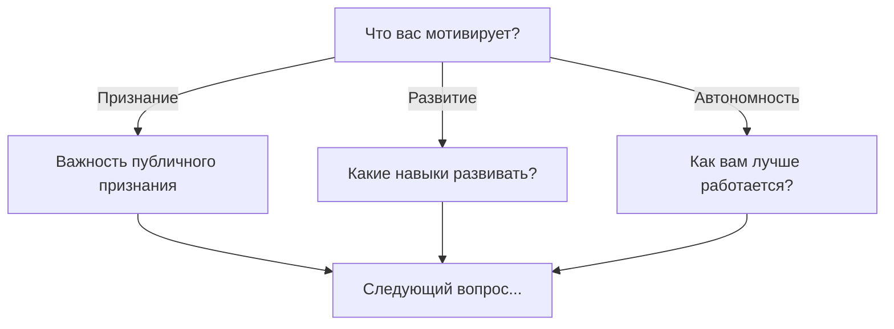
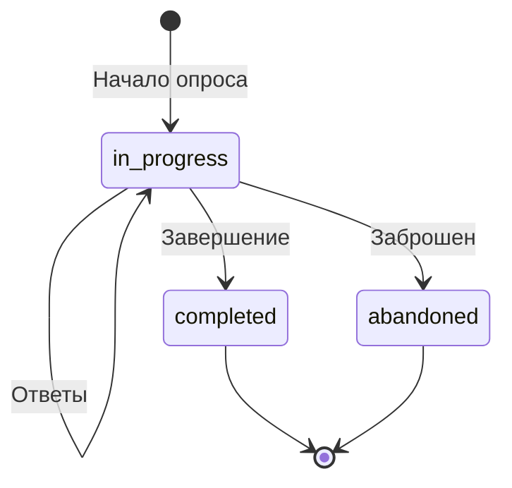

# Система опросов

## Цель системы опросов

Система опросов позволяет проводить структурированное профилирование сотрудников по научно обоснованным методикам. Результаты опросов используются для:

- **Понимания личности** сотрудника
- **Выбора стиля коммуникации** с ним
- **Генерации AI-характеристики**
- **Персонализации рекомендаций** для руководителя

---

## Поддерживаемые методики

### DISC

**DISC** — модель поведенческих типов, описывающая как человек взаимодействует с окружающим миром.

| Тип | Название | Характеристика |
|-----|----------|----------------|
| **D** | Dominance | Прямой, решительный, ориентирован на результат |
| **I** | Influence | Общительный, оптимистичный, ориентирован на людей |
| **S** | Steadiness | Стабильный, терпеливый, ориентирован на поддержку |
| **C** | Conscientiousness | Аналитичный, точный, ориентирован на качество |

**Что даёт DISC:**
- Понимание предпочтительного стиля общения
- Как мотивировать сотрудника
- Какие задачи подходят лучше всего
- Как давать обратную связь

### Big Five (OCEAN)

**Big Five** — наиболее научно обоснованная модель личности из психологии.

| Фактор | Название | Высокий балл | Низкий балл |
|--------|----------|--------------|-------------|
| **O** | Openness | Любопытный, творческий | Практичный, традиционный |
| **C** | Conscientiousness | Организованный, дисциплинированный | Гибкий, спонтанный |
| **E** | Extraversion | Общительный, энергичный | Сдержанный, независимый |
| **A** | Agreeableness | Дружелюбный, доверчивый | Критичный, требовательный |
| **N** | Neuroticism | Эмоциональный, тревожный | Спокойный, стрессоустойчивый |

**Что даёт Big Five:**
- Глубокое понимание личности
- Предсказание поведения в разных ситуациях
- Совместимость в команде
- Риски и потенциал развития

---

## Как проходит опрос

### 1. Начало опроса

Руководитель запускает опрос для сотрудника:
- Выбирает тип опроса (DISC / Big Five)
- Может привязать к конкретной встрече
- Сотрудник получает ссылку

### 2. Прохождение

Сотрудник отвечает на вопросы:
- Вопросы появляются по одному
- Есть прогресс-бар
- Можно вернуться назад
- Промежуточные результаты сохраняются

### 3. Завершение

После завершения:
- Подсчитываются баллы по шкалам
- Запускается LLM-интерпретация
- Результаты сохраняются в профиль

---

## Структура вопросов

### Типы вопросов

| Тип | Описание | Пример |
|-----|----------|--------|
| `single-choice` | Выбор одного варианта | "Что вас больше мотивирует?" |
| `multiple-choice` | Несколько вариантов | "Какие навыки хотите развивать?" |
| `rating` | Шкала 1-10 | "Оцените важность признания" |
| `text` | Короткий текст | "Опишите идеальный рабочий день" |
| `textarea` | Длинный текст | "Расскажите о главном достижении" |

### Условная логика

Вопросы могут зависеть от предыдущих ответов:



---

## LLM-интерпретация

После подсчёта баллов LLM генерирует:

### Для DISC

```json
{
  "scores": { "D": 75, "I": 60, "S": 45, "C": 55 },
  "primary_type": "D",
  "secondary_type": "I",
  "interpretation": "Иван — прямой и целеустремлённый человек с развитыми навыками влияния. Предпочитает быстрые решения и активное общение. Рекомендуется давать сложные задачи с чёткими целями."
}
```

### Для Big Five

```json
{
  "scores": { "O": 70, "C": 65, "E": 55, "A": 60, "N": 40 },
  "interpretation": "Открыт новому опыту, организован и дисциплинирован. Умеренно общителен, предпочитает небольшие группы. Эмоционально стабилен, хорошо справляется со стрессом."
}
```

---

## Интеграция с другими модулями

### Характеристика сотрудника

Результаты DISC и Big Five автоматически учитываются при генерации AI-характеристики. Система объединяет:
- Данные DISC
- Данные Big Five
- Историю встреч
- Выполнение договорённостей

### AI-ассистент

Ассистент использует профиль для:
- Персонализации вопросов
- Учёта стиля общения
- Рекомендаций по мотивации

### BOS-анализ

BOS и опросы дополняют друг друга:
- **Опросы** — самооценка и личность
- **BOS** — наблюдаемое поведение

---

## Жизненный цикл результата



| Статус | Описание |
|--------|----------|
| `in_progress` | Опрос в процессе прохождения |
| `completed` | Успешно завершён |
| `abandoned` | Заброшен (не завершён за 24 часа) |

---

## Настройки опросов

| Настройка | Описание |
|-----------|----------|
| `allowBack` | Можно ли возвращаться к предыдущим вопросам |
| `showProgress` | Показывать прогресс-бар |
| `randomizeOptions` | Перемешивать варианты ответов |
| `savePartialResults` | Сохранять промежуточные результаты |

---

## Преимущества для бизнеса

1. **Научная основа** — методики DISC и Big Five валидированы исследованиями
2. **Объективность** — результаты не зависят от настроения руководителя
3. **Масштабируемость** — один опрос для всех сотрудников
4. **AI-обогащение** — LLM превращает баллы в практические рекомендации
5. **Интеграция** — данные используются во всех модулях системы

---

## Связанная документация

- [AI-характеристики](characteristics.md)
- [API опросов](../api/surveys-api.md)
- [Схема базы данных](../DATABASE.md)
